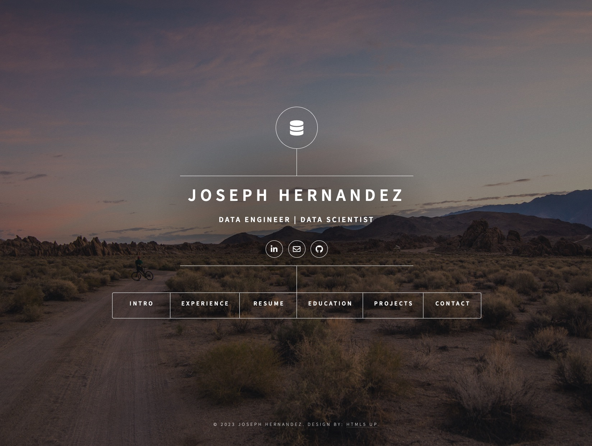

# Personal Webfolio

This personal webpage / portfolio project served to assist in my transition to a new career and
familiarize my self with the web frameworks in preparation for my M.S. in Data Science capstone project.
The project utilizes Django for the web, Postgres for the Database, Gunicorn for the web server,
Nginx for the a proxy server, and the Let's Encrypt Companion for obtaining, managing, and renewing
SSL/TLS certificates. Each component was containerized using Docker and deployed on a Linode server.
The HTML was modified from HTML5 UP's template and additional CSS was added. Domain and DNS was set
up using namecheap.com and Linode.

[Personal Website](https://jshernandez05.com)

